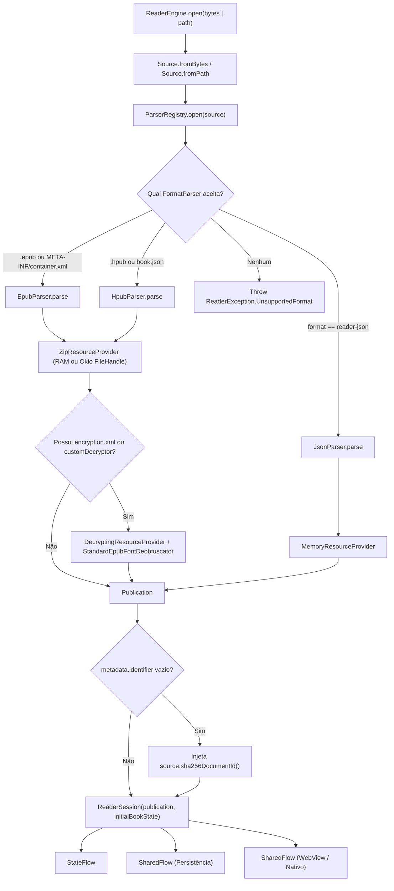

# Fluxograma do Módulo `reader-core`

> **Gerado por:** Reversa Archaeologist (`escavacao` — Nível `detalhado`)

```mermaid
flowchart TD
    A["ReaderEngine.open(bytes | path)"] --> B["Source.fromBytes / Source.fromPath"]
    B --> C["ParserRegistry.open(source)"]
    C --> D{"Qual FormatParser aceita?"}
    D -->|"format == reader-json"| E["JsonParser.parse"]
    D -->|".epub ou META-INF/container.xml"| F["EpubParser.parse"]
    D -->|".hpub ou book.json"| G["HpubParser.parse"]
    D -->|"Nenhum"| H["Throw ReaderException.UnsupportedFormat"]

    E --> I["MemoryResourceProvider"]
    F --> J["ZipResourceProvider (RAM ou Okio FileHandle)"]
    G --> J

    J --> K{"Possui encryption.xml ou customDecryptor?"}
    K -->|"Sim"| L["DecryptingResourceProvider + StandardEpubFontDeobfuscator"]
    K -->|"Não"| M["Publication"]
    L --> M
    I --> M

    M --> N{"metadata.identifier vazio?"}
    N -->|"Sim"| O["Injeta source.sha256DocumentId()"]
    N -->|"Não"| P["ReaderSession(publication, initialBookState)"]
    O --> P

    P --> Q["StateFlow<ReaderState>"]
    P --> R["SharedFlow<ReaderEvent> (Persistência)"]
    P --> S["SharedFlow<ReaderUiEffect> (WebView / Nativo)"]
```
