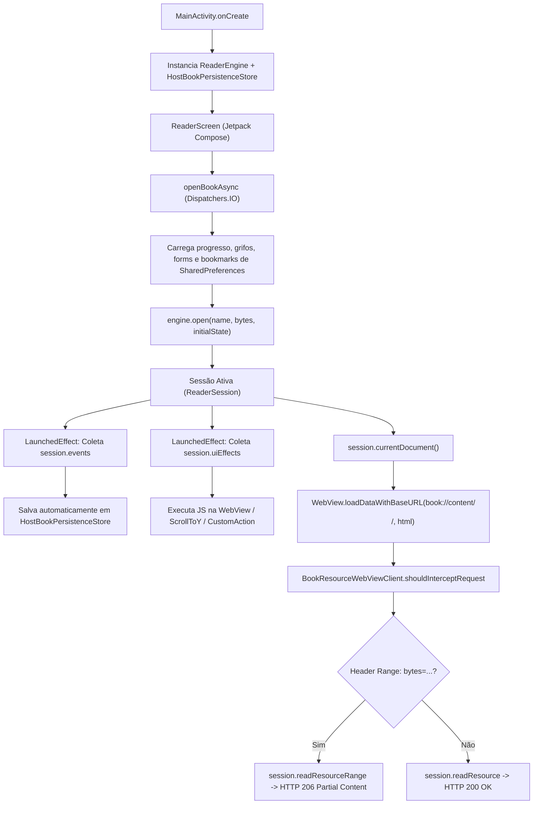

# Fluxograma do Módulo `sample-android`

> **Gerado por:** Reversa Archaeologist (`escavacao` — Nível `detalhado`)

```mermaid
flowchart TD
    A["MainActivity.onCreate"] --> B["Instancia ReaderEngine + HostBookPersistenceStore"]
    B --> C["ReaderScreen (Jetpack Compose)"]
    C --> D["openBookAsync (Dispatchers.IO)"]
    D --> E["Carrega progresso, grifos, forms e bookmarks de SharedPreferences"]
    E --> F["engine.open(name, bytes, initialState)"]
    F --> G["Sessão Ativa (ReaderSession)"]

    G --> H["LaunchedEffect: Coleta session.events"]
    H --> I["Salva automaticamente em HostBookPersistenceStore"]

    G --> J["LaunchedEffect: Coleta session.uiEffects"]
    J --> K["Executa JS na WebView / ScrollToY / CustomAction"]

    G --> L["session.currentDocument()"]
    L --> M["WebView.loadDataWithBaseURL(book://content/<dir>/, html)"]
    M --> N["BookResourceWebViewClient.shouldInterceptRequest"]
    N --> O{"Header Range: bytes=...?"}
    O -->|"Sim"| P["session.readResourceRange -> HTTP 206 Partial Content"]
    O -->|"Não"| Q["session.readResource -> HTTP 200 OK"]
```
